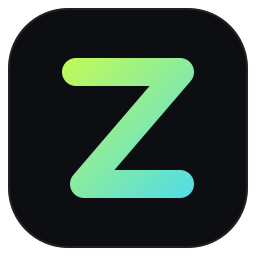
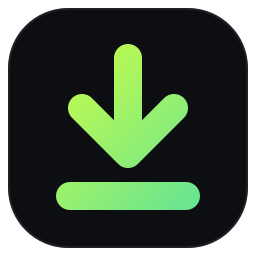
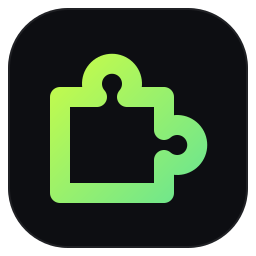
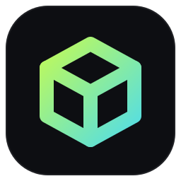

# Zenless

**Download faster. Torrent smarter. Stay zen.**

A family of tiny, native Windows apps written in Rust: a multi-connection download manager, a BitTorrent client
and browser integration for Chrome and Firefox. Separate apps, not a bloated all-in-one. Install only the ones you want.

[**Website**](https://zenless-suite.vercel.app) ·
[**Download Zenless Setup**](https://github.com/zenless-inc/zenless-installer/releases/latest/download/ZenlessSetup.exe) ·
[All downloads](https://zenless-suite.vercel.app/download) ·
[Privacy](https://zenless-suite.vercel.app/privacy)

---

## The apps

| | Project | What it does |
|:---:|---|---|
|  | [**Zenless Download Manager**](https://github.com/zenless-inc/zenless-download-manager) | Up to 32 connections per file with IDM-style dynamic segmentation, pause/resume that survives restarts, queue, speed limiter, categories, clipboard watch and a live segment map. |
|  | [**Zenless Torrent**](https://github.com/zenless-inc/zenless-torrent-client) | Magnet links and `.torrent` files, per-file selection, DHT, UPnP, speed limits and seeding stats, powered by [librqbit](https://github.com/ikatson/rqbit). |
|  | [**Browser Integration for Chrome**](https://github.com/zenless-inc/zenless-chrome-extension) · [**for Firefox**](https://github.com/zenless-inc/zenless-firefox-extension) | Hands downloads to the Download Manager and magnets to Zenless Torrent. Works in Chrome, Edge, Brave, Vivaldi, Opera and Firefox, and includes a media sniffer and "download all links". |
|  | [**Zenless Setup**](https://github.com/zenless-inc/zenless-installer) | One installer, your choice of components. Per-user install without admin rights, a theme picker, clean uninstall and `--silent` mode. |
| | [**Website**](https://github.com/zenless-inc/zenless-website) | The static site at [zenless-suite.vercel.app](https://zenless-suite.vercel.app). |

## Highlights

- **Native and small.** Rust, [egui](https://github.com/emilk/egui) and [tokio](https://tokio.rs). No Electron and no background services.
- **Themes everywhere.** 13 built-in themes (Zenless, Midnight, Dracula, Nord, Tokyo Night, Catppuccin Mocha, Gruvbox,
  Rosé Pine, Neon Cyber, Forest, Solarized Light, Paper, High Contrast) plus your own custom themes, shared live across every Zenless app.
- **Private by design.** No telemetry and no accounts. The browser extensions only talk to the apps on `127.0.0.1`.
- **Open source.** Everything is MIT licensed.

## Get started

1. Download [**ZenlessSetup.exe**](https://github.com/zenless-inc/zenless-installer/releases/latest/download/ZenlessSetup.exe). It includes everything and works offline.
2. Pick the apps you want, choose a theme, and install. No admin rights are needed.
3. Connect your browser from the last page of the installer, or follow the [extension setup guide](https://zenless-suite.vercel.app/download).

> Zenless is new (v0.1) and not code-signed yet, so Windows SmartScreen may warn you. Click **More info → Run anyway**.

## Contributing

Bug reports, ideas and pull requests are welcome. Read the [contributing guide](https://github.com/zenless-inc/.github/blob/main/CONTRIBUTING.md)
and please report security issues privately as described in the [security policy](https://github.com/zenless-inc/.github/blob/main/SECURITY.md).
